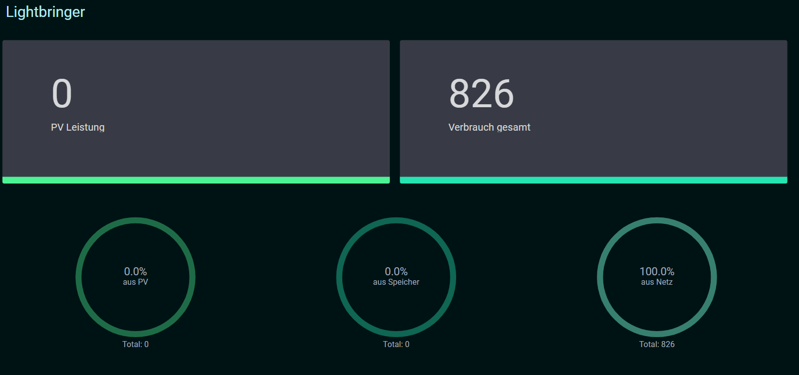
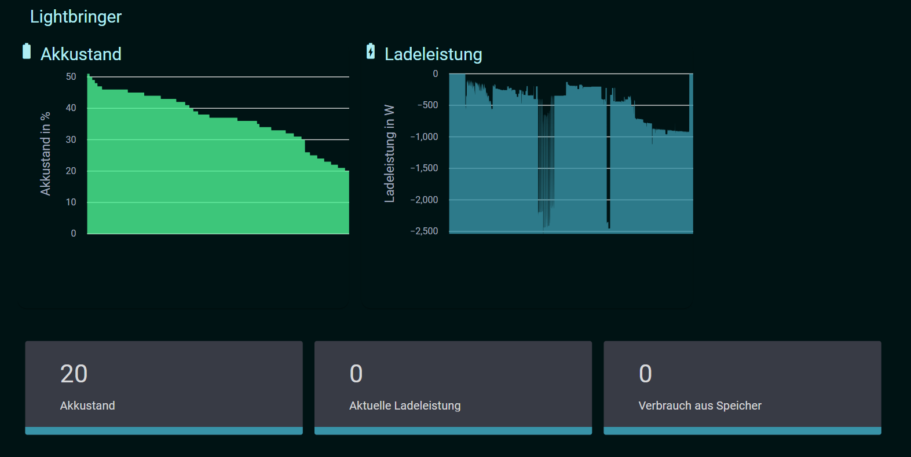

# SICAS

SICAS ist eine Lösung, um Modbus-Informationen von Plenticore plus 10 auszulesen und in einem Angular-Frontend darzustellen.


## Features

- Auslesen von Modbus-Daten mit Java.
- Visualisierung der Daten in einem modernen Angular-Frontend.
- Integration mit Docker zur einfachen Bereitstellung.



## Voraussetzungen

- Java 11+
- Node.js und Angular CLI
- Maven
- Docker (optional)

## Installation

1. Klone das Repository:
   ```sh
   git clone https://github.com/tobkir/com.tobkir.lightbringer.git

2. Build Project
    ```sh
    mvn clean install
   
3. Build Image
    ```sh
   docker build -t lightbringer .

4. Start project
    ```sh
   docker compose up -d